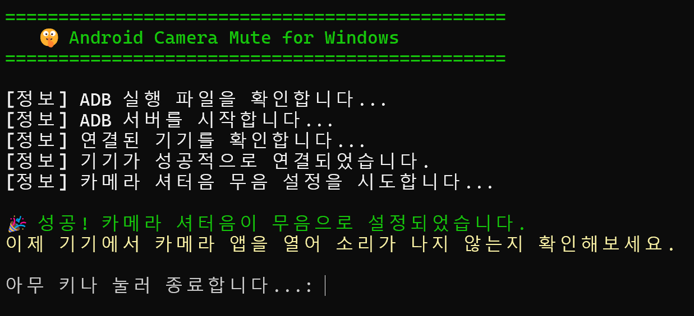
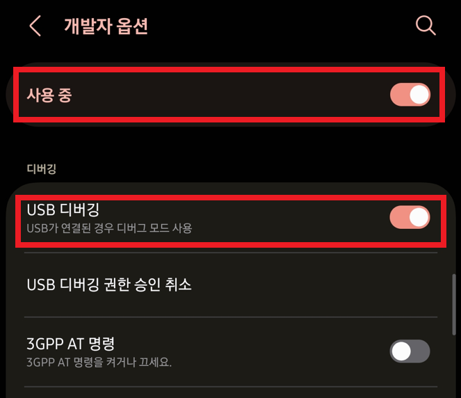
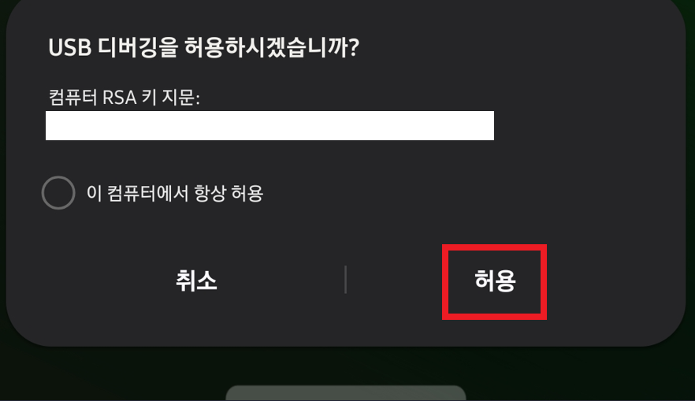
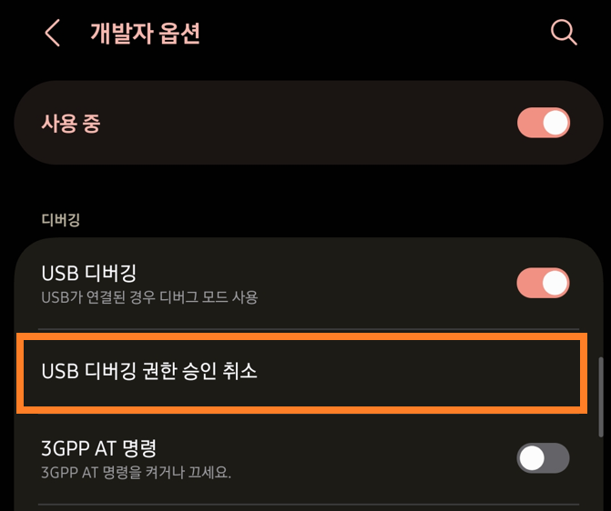

# 🤫 Android Camera Mute

ADB를 사용하여 안드로이드 기기의 카메라 셔터음을 무음으로 설정하는 PowerShell 스크립트입니다. 필요한 ADB 도구가 함께 포함되어 있어 별도의 설치 없이 바로 사용할 수 있습니다.

 

## ✨ 시연 (Demonstration)

 

## ⭐️ 주요 기능

* 안드로이드 기기의 카메라 셔터음을 무음으로 설정합니다.
* 별도의 ADB(Android Debug Bridge) 설치 없이 즉시 사용 가능합니다.
* 기기 연결 및 인증 오류를 자동으로 감지하고 해결 방법을 안내합니다.

 

## 🚀 사용 방법 (Usage)

1.  이 페이지 우측 상단의 **Code** 버튼을 누르고 **Download ZIP**을 클릭하여 압축 파일을 받습니다.
2.  받은 압축 파일의 압축을 풉니다.
3.  **압축을 푼 폴더 안으로 직접 들어가서**, `run.ps1` 파일에 마우스 오른쪽 클릭 후 **PowerShell에서 실행**을 선택합니다.

 

## ✅ 요구 사항 (Prerequisites)

* **운영체제**: Windows 10 이상
* **필요 조건**: 안드로이드 기기의 **설정 > 개발자 옵션**에서 **USB 디버깅**이 활성화되어 있어야 합니다.

 

## 🤔 Q&A

**Q: 스크립트를 실행했는데 `unauthorized` 라고 표시됩니다.**

A: 스크립트의 안내에 따라 아래 방법을 시도해 보세요.
1.  핸드폰 화면을 켜서 **'USB 디버깅을 허용하시겠습니까?'** 팝업 창이 있는지 확인하고 '허용'을 누릅니다.

2.  팝업이 없다면, 핸드폰의 **개발자 옵션** 메뉴에서 **USB 디버깅 승인 취소**를 실행한 후, USB 케이블을 뽑았다가 다시 연결하여 팝업이 나타나는지 확인하세요.

**Q: `.\adb\adb` 관련 오류가 발생합니다.**

A: `run.ps1` 스크립트와 `adb` 폴더가 같은 위치에 있는지 확인해주세요. 압축을 푼 폴더 구조를 그대로 유지해야 합니다.

 

## ⚠️ 면책 조항 (Disclaimer)

이 스크립트는 모든 안드로이드 기기에서 작동하는 것을 보장하지 않습니다. 이 스크립트의 사용으로 인해 발생하는 모든 문제에 대한 책임은 사용자 본인에게 있습니다.

 

## 📄 라이선스 (License)

* **스크립트 (`run.ps1`)**: 이 스크립트는 [MIT 라이선스](./LICENSE)를 따릅니다.
* **ADB 도구**: 함께 제공되는 ADB(Android Debug Bridge) 도구는 Google LLC의 자산이며, Apache License 2.0이 적용됩니다. 라이선스 전문은 `adb/NOTICE.txt` 파일에서 확인하실 수 있습니다.
    > This project includes Android Debug Bridge (adb) tools, which are property of Google LLC and are licensed under the Apache License 2.0. You can find the full license text in the `adb/NOTICE.txt` file.
